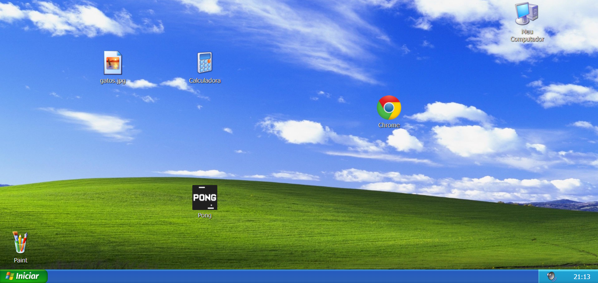

<h1 align="center">
     🖥️ <a href="#" alt="site "> Clone Windows XP </a>
</h1>

<h3 align="center">
    🖥️ Um clone do querido Windows XP! 💾
</h3>

  

  
  
  
    
   

   
 

<h4 align="center">
	🚧   Concluído 🚀 🚧
</h4>

## 💻 Sobre o projeto

💻 Clone Windows XP. 

Originalmente um trabalho da faculdade (disciplina de desenvolvimento web) onde o tema para desenvolvimento era livre.

---

## ⚙️ Funcionalidades

- [x] Visitantes podem testar as funcionalidades clonadas do Windows XP:
  - [x] acessar a pasta Meu Computador
  - [x] utilizar a calculadora
  - [x] jogar o jogo Pong
  - [x] navegar pelo Chrome
  - [x] fazer desenhos no Paint
  - [x] arrastar icones da área de trabalho
  - [x] abrir o menu iniciar
  - [x] além de abrir uma imagem: 
    - esta imagem aberta é aleatória, depende do retorno da API de gatos (https://cataas.com/cat)

---

## 🎨 Layout

### Web

  

---

## 🚀 Acesso a aplicação web

##### pelo link em: https://viniporto.github.io/clone-windows-xp/

---

## 🛠 Tecnologias

As seguintes ferramentas foram usadas na construção do projeto:

#### **Website** 

-   **[Html](https://www.w3schools.com/html/)**
-   **[CSS](https://www.w3schools.com/css/)**
-   **[Javascript](https://developer.mozilla.org/pt-BR/docs/Web/JavaScript)**

---

## 👨‍💻 Contribuidores

❤️ Um super agradecimento 👏 para a Mirella Naspolini que auxiliou demais com o CSS:

<table>
  <tr>
    <td align="center"><a href="https://github.com/mirellanaspolini"> <b>Mirella Naspolini</b></a> <a href="https://github.com/mirellanaspolini" title="Mirella">🐧</a></td>
  </tr>
</table>

## 💪 Como contribuir no projeto

1. Faça um **fork** do projeto.
2. Crie uma nova branch com as suas alterações: `git checkout -b my-feature`
3. Salve as alterações e crie uma mensagem de commit contando o que você fez: `git commit -m "feature: My new feature"`
4. Envie as suas alterações: `git push origin my-feature`
> Caso tenha alguma dúvida confira este [guia de como contribuir no GitHub](./CONTRIBUTING.md)

---

## 🦸 Autor

<a href="https://github.com/ViniPorto">
 
  
 <b>Vinícius Porto</b></a> <a href="https://github.com/ViniPorto" title="ViniPorto">🚀</a>
  

 

---

## 📝 Licença

Este projeto não possui licença. Livre para copiar! :D

Feito com ❤️ por Vinícius Porto 👋🏽 [Entre em contato!](https://www.linkedin.com/in/vinicius-porto-9a1996209/)

---
